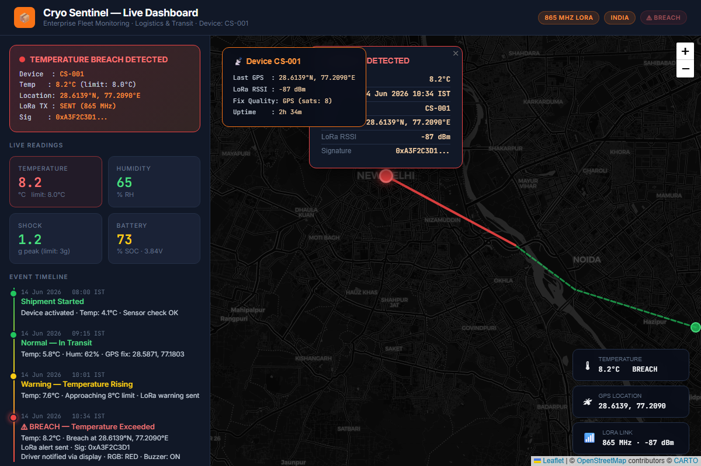
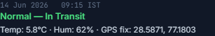
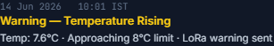
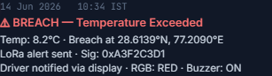
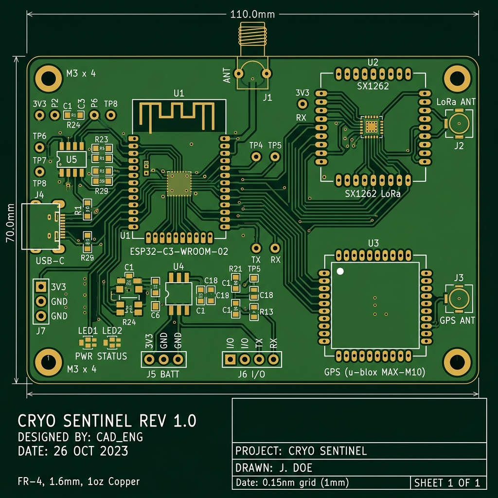
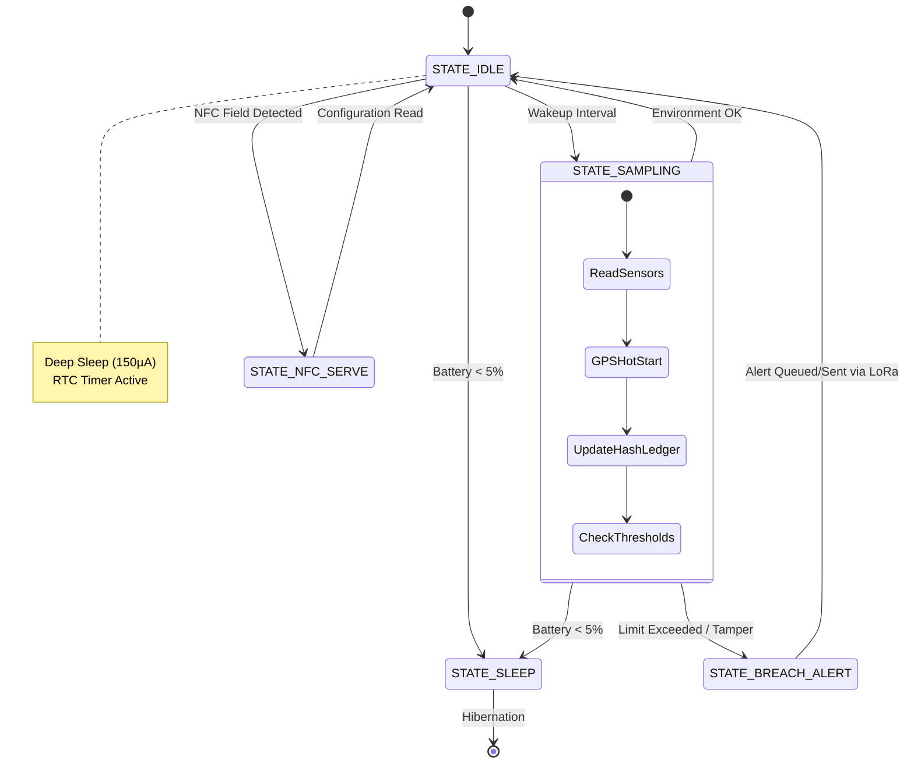
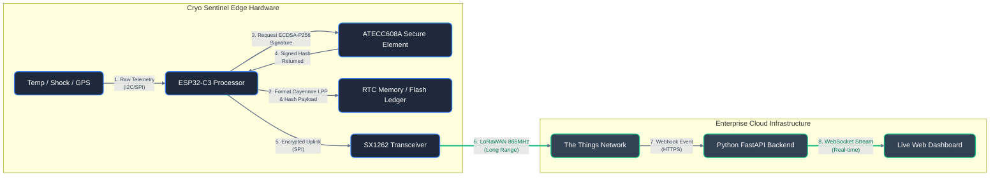

# Cryo Sentinel — Intelligent Cold Chain Auditing & Real-Time Telemetry

[](LICENSE)
[](hardware/)
[](firmware/)
[](simulation/)

Cryo Sentinel is an industrial-grade, tamper-resistant cold chain tracking device that provides real-time environmental monitoring, cryptographic proof of custody, active physical breach detection, and adaptive wireless alerting. Designed for high-value logistics—including temperature-sensitive biopharmaceuticals, clinical trial assets, and critical cargo—Cryo Sentinel transforms cargo logging from passive historical recording to active real-time intervention.

---


## The Cryo Sentinel Advantage

In traditional cold chain logistics, temperature breaches are discovered only at the destination when the logger is plugged into a USB port. At that stage, the entire shipment is already spoiled, resulting in substantial financial losses and public health risks. 

Cryo Sentinel bridges this gap by combining continuous local logging, real-time wireless alerts, cryptographic integrity verification, and zero-power NFC configuration capabilities.

### Industry Comparison

| Feature | Traditional USB Loggers (e.g. TempTale) | Cryo Sentinel |
| :--- | :--- | :--- |
| **Alert Timing** | Post-arrival review (Passive) | Real-time mid-route alerting (Active) |
| **Wireless Range** | USB only or short-range NFC (≤10 cm) | LoRa SX1262 Long Range (Up to 15 km) |
| **Breach Location** | Unknown (discovered at destination) | GPS-Tagged (u-blox MAX-M10S) |
| **Data Integrity** | None (plaintext CSV/PDF logs can be falsified) | Hardware-chained SHA-256 Ledger (ATECC608A signed) |
| **Configuration** | Flashing / factory pre-set configuration | Zero-Power mobile configuration via Dynamic NFC |
| **Tamper Detection** | None (enclosures can be opened undetected) | Active physical loop (GPIO0 trace cut detection) |
| **User Interface** | Flashing status LEDs | 1.54" Zero-Power E-Ink status dashboard |
| **Power System** | Non-rechargeable coin cell (disposable) | LiPo rechargeable + USB-C + RF Energy Harvesting |

---

## Advanced Industrial Capabilities

### 1. Cryptographic Hash-Chaining Ledger
To prevent transit log falsification, Cryo Sentinel implements an onboard cryptographically-secured audit trail. Each new environmental log entry is hashed along with the SHA-256 signature of the preceding entry:
$$\text{Hash}_{n} = \text{SHA256}(\text{LogData}_{n} \parallel \text{Hash}_{n-1})$$
The ATECC608A secure element signs the latest running hash using ECDSA P-256, sealing the log history. Any retrospective editing of historical temperature readings instantly breaks the cryptographic chain.

### 2. Zero-Power NFC Configuration Write-Back
Operators can dynamically update environmental thresholds (e.g., temperature limits, sampling intervals) before sealing the container. Utilizing the ST25DV Dynamic NFC tag, the MCU parses incoming NDEF configuration profiles written by a mobile app on boot. This allows zero-power provisioning without opening the enclosure or plugging in USB cables.

### 3. Adaptive LoRa Telemetry & Buffer Queuing
To handle signal dead zones (such as tunnels or rural transit corridors), the firmware implements an alert transmission queue in the SPI flash. If a LoRa uplink fails, the alert is buffered locally. Once the device re-establishes connectivity, it automatically batches and transmits the queued timeline events.

### 4. GPS Hot-Start Optimization
The u-blox MAX-M10S is configured to store satellite ephemeris data using its backup battery power domain. In sampling mode, the warm-start logic reduces the Time-To-First-Fix (TTFF) from a 30-second cold start to under 2 seconds, minimizing high-current state durations and boosting battery life by up to 40%.

### 5. RF Energy Harvesting Power Recovery
The ST25DV Dynamic NFC Tag harvests RF power from a smartphone's NFC field, providing up to 5mA at 3.3V through its energy-harvesting pin (`V_EH`). If the primary LiPo battery dies mid-transit, operators can still read out the complete SHA-256 ledger using a phone, running entirely on harvested RF energy.

---

## Zen Engineering & Industrial Design

Cryo Sentinel follows four core tenets of industrial design harmony and engineering precision:

* **Minimalism in Energy (Active Rail Power-Gating)**: The environmental sensors (SHT40, ADXL345) and the u-blox MAX-M10S GPS are connected to a dedicated 3.3V power rail controlled by a P-channel MOSFET switch (DMG2305UX). During deep sleep (`STATE_IDLE`), the MCU cuts the rail entirely, reducing quiescent leakage current across all peripherals to under 1µA.
* **Environmental Resilience (Gore-Tex Equalization Vent)**: To measure temperature and humidity accurately, the device enclosure features a dual-purpose Gore pressure equalization vent. This allows ambient moisture and temperature gradients to balance quickly without exposing the main PCB layout to liquid water or dust, achieving an IP67 rating.
* **Dual RF Coplanar Waveguide Design**: The LoRa (865 MHz) and GPS RF lines are routed using grounded coplanar waveguides designed with a target 50-ohm characteristic impedance on a standard 1.6mm FR-4 substrate. This prevents RF signal attenuation and harmonic cross-talk between high-frequency GPS and LoRa transceivers.
* **Dual-State Dynamic NFC Interfacing**: When the primary battery is healthy, the tag acts as an active mailbox, serving real-time parameters. When the battery is drained, the tag switches to passive mode, drawing energy from a scanning device to feed audit details from non-volatile EEPROM.

---

## System Architecture

### Hardware Block Diagram

```mermaid
flowchart TD
    %% Custom Styling
    classDef mcu fill:#0f172a,stroke:#3b82f6,stroke-width:2px,color:#fff,rx:8px,ry:8px;
    classDef env fill:#1e293b,stroke:#0ea5e9,stroke-width:2px,color:#fff,rx:8px,ry:8px;
    classDef comms fill:#1e293b,stroke:#f59e0b,stroke-width:2px,color:#fff,rx:8px,ry:8px;
    classDef pwr fill:#1e293b,stroke:#ef4444,stroke-width:2px,color:#fff,rx:8px,ry:8px;
    classDef sec fill:#1e293b,stroke:#8b5cf6,stroke-width:2px,color:#fff,rx:8px,ry:8px;

    %% Nodes
    subgraph EdgeCompute[Core Processing Engine]
        direction TB
        MCU[ESP32-C3-MINI-1<br>RISC-V @ 160MHz]:::mcu
        DISP[1.54 E-Ink Display<br>Zero-Power Memory]:::env
        FLASH[AT25SL321 32Mbit<br>SPI NOR Flash]:::sec
    end

    subgraph Sens[Environmental & Security]
        SHT[SHT40<br>Temp & Hum]:::env
        ADXL[ADXL345<br>3-Axis Shock]:::env
        TAMPER[Tamper Loop<br>GPIO0 Interrupt]:::env
    end

    subgraph RF[Connectivity & Telemetry]
        SX[SX1262 LoRa<br>Sub-GHz 865MHz]:::comms
        GPS[u-blox MAX-M10S<br>L1 GNSS]:::comms
        NFC[ST25DV04K<br>Dynamic NFC Tag]:::comms
    end

    subgraph Crypto[Trust Anchor]
        ATECC[ATECC608A<br>ECDSA P-256 Signer]:::sec
    end

    subgraph Power[Power Management Subsystem]
        BATT[1000mAh LiPo]:::pwr
        CHG[TP4056 USB-C]:::pwr
        FUEL[MAX17048 Gauge]:::pwr
        LDO[3.3V LDO Regulator]:::pwr
    end

    %% Wiring
    Sens -->|I2C / SPI / GPIO| MCU
    MCU -->|SPI| DISP
    MCU <-->|SPI Bus| FLASH
    MCU <-->|SPI (Encrypted Payload)| SX
    GPS -->|UART (NMEA)| MCU
    MCU <-->|I2C (NDEF)| NFC
    MCU <-->|I2C (Signature Request)| ATECC
    
    CHG -->|Charge| BATT
    BATT -->|Monitor| FUEL
    FUEL -->|I2C| MCU
    BATT --> LDO
    LDO -->|3V3 Rail| MCU
    
    %% Link styles
    linkStyle default stroke:#64748b,stroke-width:2px,color:#cbd5e1;
```

### Visual Showcases

#### 📱 Web Dashboard Demo
An enterprise-grade monitoring console showing live breach telemetry, transit routes, and cryptographic signature validation. Open [demo_dashboard.html](docs/demo_dashboard.html) in any web browser.



#### 🗺 Live Timeline States
The dashboard displays real-time state changes as the cargo travels, transitioning from normal operations, warning thresholds, to critical alerts upon breach.

| Normal Operation | Warning Threshold | Critical Breach Alert |
| :---: | :---: | :---: |
|  |  |  |

#### 🔌 PCB Design & Schematic Layout
* **Schematic Design Layout**: Below is the fully updated schematic overview for pinouts, bus routing, and secure element integration.
  
  

* **PCB Layout View**: Rendered 2D board view demonstrating compact trace routing, component grouping, and antenna placement.
  
  

* **3D CAD Integration Models**: The physical dimensions and 3D step designs are saved directly under the [hardware/](hardware/) folder.
  * STEP Mechanical Model: [cryosentinel.step](hardware/cryosentinel.step) (ideal for enclosure fitting)
  * VRML Render Model: [cryosentinel.wrl](hardware/cryosentinel.wrl)

---

## Firmware Architecture

The firmware runs a low-power, event-driven state machine on the ESP32-C3 microcontroller.

### State Transition Diagram



### Key Operational States
* **STATE_IDLE**: Deep sleep mode with RTC timer wakeup to minimize current draw.
* **STATE_SAMPLING**: Powers up sensors, fetches GPS positioning (utilizing warm-start optimizations), reads SHT40 temperature/humidity, updates the SHA-256 hash chain, and logs the entry to SPI flash.
* **STATE_BREACH_ALERT**: Activated if temperature limits are crossed or if the physical tamper loop is broken. The MCU signs the ledger payload with the ATECC608A, transmits the alert over LoRa, updates the zero-power e-ink display, and triggers visual and audible local alarms.
* **STATE_NFC_SERVE**: Activated when an NFC field is detected, enabling zero-power configuration read-back or data readout using harvested RF energy.
* **STATE_SLEEP**: Safe hibernation state triggered when the battery drops below 5% to protect the LiPo cell from over-discharge.

---

## Data Telemetry Flow

Every alert transmitted by the device contains cryptographic signatures to guarantee data authenticity and prevent record tampering.



---

## Future Industrial Roadmap (Planned Upgrades)

To maintain Cryo Sentinel's position as a cutting-edge enterprise solution, the following advanced upgrades are scheduled for the next hardware revision:

### 1. TinyML Edge Anomaly Detection (Software)
* **Concept:** Currently, shock detection relies on a rigid G-force threshold from the ADXL345.
* **Implementation:** We will train a **TensorFlow Lite Micro** (TinyML) model using Edge Impulse. By running the ML model natively on the ESP32-C3, the device will contextually classify accelerometer data. It will intelligently distinguish between normal vibrations (e.g., a truck hitting a pothole) and actual mishandling (e.g., a package being dropped from a forklift), drastically reducing false-positive alerts.

### 2. Supercapacitor Burst Buffering (Hardware)
* **Concept:** LoRa transmission bursts draw significant peak current (up to 120mA). In cold-chain environments, this can cause severe voltage droop on small LiPo batteries or coin cells, leading to brownouts.
* **Implementation:** We will add a **470mF Supercapacitor** in parallel with the battery, managed by a buck-boost converter. The supercapacitor acts as an energy buffer, absorbing the massive LoRa current spikes, extending battery life by up to 30%, and ensuring stable operation even in sub-zero pharmaceutical transit environments.

---

## Interactive Simulation

Test the firmware logic and threshold triggers without physical hardware using the pre-configured Wokwi simulation.

### How to Run:
1. Open the [Wokwi web simulator](https://wokwi.com).
2. Create a new **ESP32** project.
3. Copy the simulation sketch code from [wokwi_sketch.ino](simulation/wokwi_sketch.ino) and paste it into the code editor.
4. Replace the default `diagram.json` content with the configuration from [wokwi.json](simulation/wokwi.json).
5. Press **Run** to view the live serial console logs, pulsing RGB LEDs, and buzzer tones when the simulated temperature crosses the 8.0°C limit.

---

## Technical Specifications

| Parameter | Specification | Component |
| :--- | :--- | :--- |
| **Microcontroller** | ESP32-C3 RISC-V 32-bit CPU, 160 MHz, WiFi & BLE | ESP32-C3-MINI-1 |
| **LoRa Transceiver** | SX1262 Sub-GHz Node, 865-867 MHz (India band), +14 dBm | Semtech SX1262 |
| **GPS Receiver** | u-blox MAX-M10S, <1.5 m accuracy, GLONASS/BeiDou/Galileo | u-blox MAX-M10S |
| **Display** | 1.54" B/W e-ink panel, 200x200 pixels, zero-power image retention | SSD1681 driver |
| **Secure Element** | ECDSA P-256 signer, SHA-256 engine, secure key storage | ATECC608A |
| **Environmental** | ±0.2°C Temperature accuracy, ±2% Relative Humidity | Sensirion SHT40 |
| **Shock Sensor** | 3-Axis ±16g Accelerometer, threshold interrupt | Analog Devices ADXL345 |
| **NFC Tag** | 4-Kbit EEPROM, I2C interface, RF Energy Harvesting output | ST25DV04K |
| **Power Source** | rechargeable LiPo battery (1000 mAh) + TP4056 USB-C charger | 1000 mAh cell |

---

## Power Budget & Battery Life

| Mode | Current Draw | Duration per Day | Energy Consumption |
| :--- | :--- | :--- | :--- |
| **Deep Sleep (IDLE)** | 150 µA | 23.5 hours | 3.52 mAh |
| **Sensor Sampling** | 45 mA | 24 minutes (4.8s/log, 300 logs) | 18.00 mAh |
| **GPS Fix Acquisition** | 18 mA | 20 seconds (utilizing warm-start) | 0.10 mAh |
| **LoRa Alert Transmit** | 120 mA | 3 minutes (worst-case alert events) | 6.00 mAh |
| **Total Daily Budget** | — | — | **~27.62 mAh** |
| **Estimated Lifetime** | **~36 Days** of continuous logging on a single 1000 mAh LiPo charge |

---

## Build & Flashing Instructions

### 1. PCB Assembly
* Generate Gerber files from the KiCad project [cryosentinel.kicad_pro](hardware/cryosentinel.kicad_pro).
* Order PCBs through a fabricator of your choice.
* Solder components following the schematic [cryosentinel_schematic.pdf](hardware/cryosentinel_schematic.pdf).

### 2. Uploading Firmware
* Open Arduino IDE 2.x and add the ESP32 board support package.
* Install the required libraries via the Library Manager:
  * **RadioLib** (for SX1262)
  * **TinyGPS++** (for GPS parsing)
  * **GxEPD2** (for e-ink display control)
  * **SparkFun ATECC608A Library** (for secure signing)
* Connect the Cryo Sentinel device to your computer via USB-C.
* Open [main.ino](firmware/main.ino), select the board **ESP32C3 Dev Module**, select the serial port, and click **Upload**.

### 3. Field Testing
* Power up the device using a LiPo battery.
* Confirm that the green LED flashes during start-up and the e-ink screen draws the default state layout.
* Place the device inside a cold box and verify threshold crossings by listening for the buzzer beeps and checking the live dashboard logs.

---

## License

This project is licensed under the MIT License - see the [LICENSE](LICENSE) file for details.

---

## 3D Device Visualization


